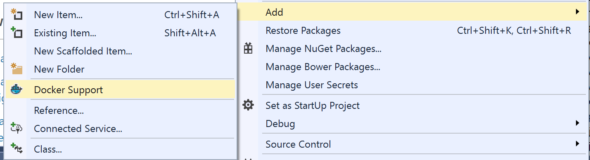
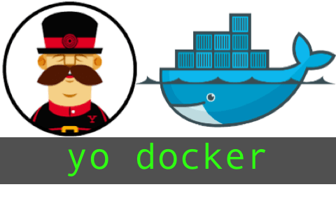
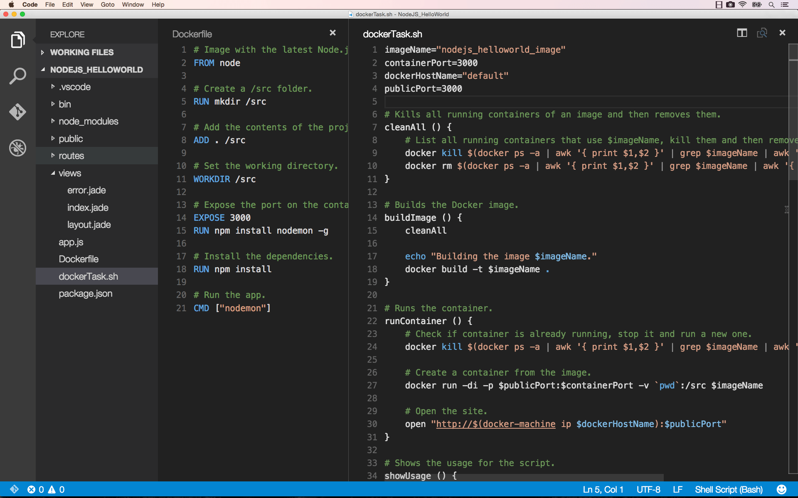

# Docker Tools Documentation
A list of tools being developed at Microsoft for working with Docker Containers

##Docker Tools for Visual Studio##

[DockerToolsForVisualStudio ](http://aka.ms/DockerToolsForVS)

The Visual Studio 2015 Tools for Docker Preview enables developers to build and publish an ASP.NET 5 Web or console application to a Docker container running on a Linux or Windows virtual machine.

##yo docker##

Scaffolding of Dockerfiles and scripts to build and run your Docker containers

To assist developers getting started, and those developers already using docker with the appropriate Dockerfile and associated scripts to build and run your docker containers. This yoeman generator will prompt you with a few questions, asking your development language and target container host. Two files will be added to the directory

- `Dockerfile` - the Dockerfile associated with your target language
- `dockerTask.sh` - a bash script that contains the common tasks associated with building and running your docker containers
	parameters supported for  dockerTask.sh
	- `build` - builds the Docker image
	- `run` - runs the Docker image on the default port, removing any current running containers for the same port
	- `buildrun` - the default, which does what the name implies... 

[A 5 minute demo showing yo docker with NodeJS apps and VSCode](https://youtu.be/_afFgiHiHO8)

###Installing yo docker on Mac###
1. Install [NodeJs](http://nodejs.org)
2. Install Yo by running the following command from the Terminal: 

	`npm -g install yo`

3. Install Docker generator: 
	
	`npm -g install generator-docker`
4. From the directory of your project, run the Docker generator: 
	
	`yo docker`

###Installing yo docker on Windows###
*Coming soon*

While you can install the same yo docker tools above for the mac, the scripts generated are bash scripts. We are working on generating .cmd scripts as a Windows Developer would expect. 
